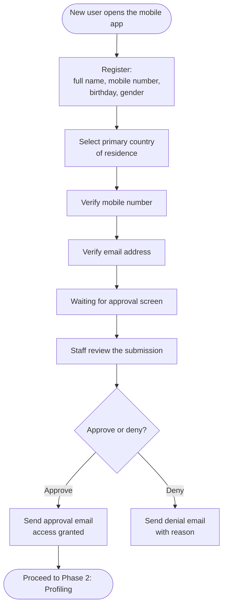
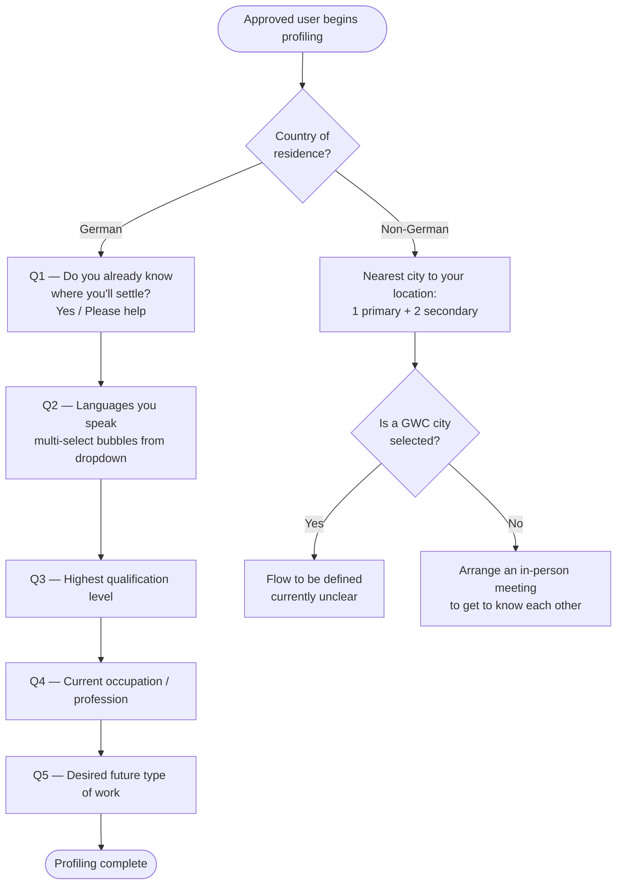

# German World Club — Business Description

This document describes the **business logic and behavior** of the existing application, independent of implementation technology, so that the same system can be rebuilt on a different stack while preserving how it actually works for members, staff, and partners.

---

## Onboarding — Phase 1: Verification Workflow

**Steps**

1. A new mobile-app user registers by providing their **full name**, **mobile number**, **birthday**, and **gender**.
2. The user selects their **primary country of residence**, then **verifies their mobile number**.
3. The user then **verifies their email address**.
4. After verification, the user is shown a **"Waiting for approval"** screen.
5. Staff review the submission and **approve or deny** access (a reason is required on denial). Both approval and denial trigger an **email notification**.

---

## Onboarding — Phase 2: Profiling Workflow

After approval, the second onboarding step begins. The questions branch on the **country of residence** selected in Phase 1.

### If the country of residence is Germany

1. **Do you already know where you'll be settling, or should we help you find the right place?**
   - Yes
   - Please help
2. **What languages do you speak?**
   - Selected from a **language dropdown**; each selection is added as a **bubble** on the screen (multi-select).
3. **What is your highest degree / level of qualification?**
   - No formal qualification
   - Secondary / High School
   - Diploma / Certificate
   - Associate Degree
   - Bachelor's Degree
   - Master's Degree
   - Doctorate (PhD)
   - Professional Qualification (e.g., CA, CPA, MBA)
4. **What is your current occupation / profession?**
   - Student
   - Unemployed
   - Self-Employed / Business Owner
   - Government Employee
   - Private Sector Employee
   - Teacher / Educator
   - Healthcare Professional (Doctor, Nurse, etc.)
   - Engineer
   - IT / Software Professional
   - Accountant / Finance Professional
   - Lawyer / Legal Professional
   - Sales / Marketing Professional
   - Consultant
   - Homemaker
   - Retired
   - Freelancer
   - Other
5. **What kind of job would you like to do in the future?**
   - Employee
   - Freelance
   - I want to build my own business and ideas
   - I am not sure yet

### If the country of residence is not Germany

- **What is the nearest city to your current location?**
  - Provide **Country** and **City** — one **primary** city plus **two secondary** cities.
- **If a GWC city is selected:**
  - The flow is currently unclear / to be defined.
- **If no GWC city is selected:**
  - We will meet in person to get to know each other.

---

## Core Server Functions and Identities

| Priority | Function | Notes |
|----------|----------|-------|
| P1 | **Profile** | Member, Partner, Merchant, Influencer |
| P1 | **Threads** | |
| P1 | **Events** | |
| P1 | **Influencer Affiliate** | Special private link for the onboarding process |
| P2 | **Benefits / Offers** | |
| P2 | **Marketplace** | |
| P3 | **Financial Services / Wealth** | |
| P3 | **Travel** | |